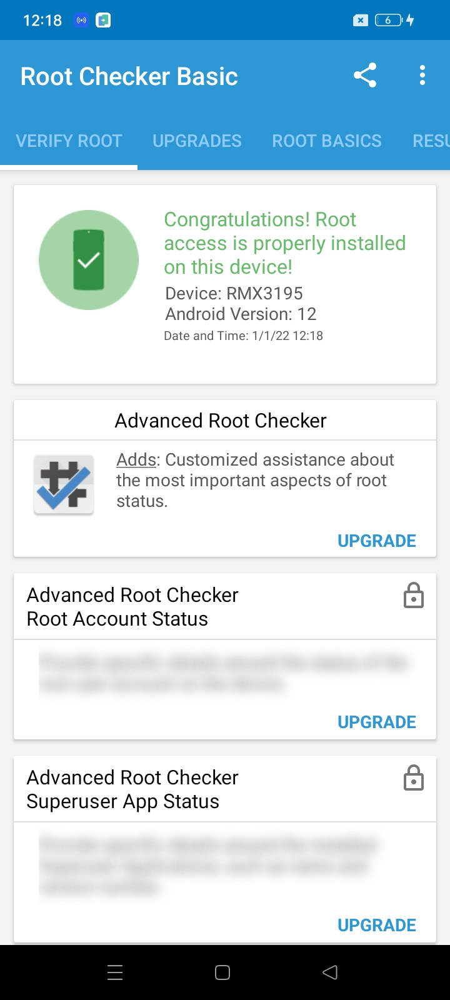
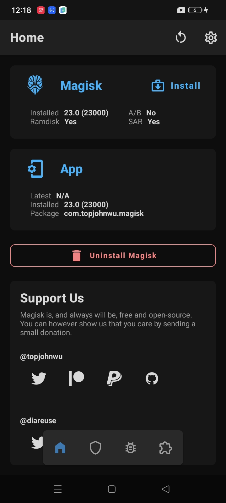
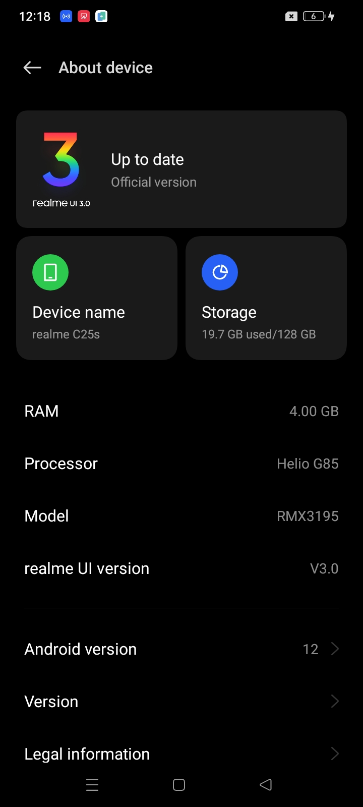
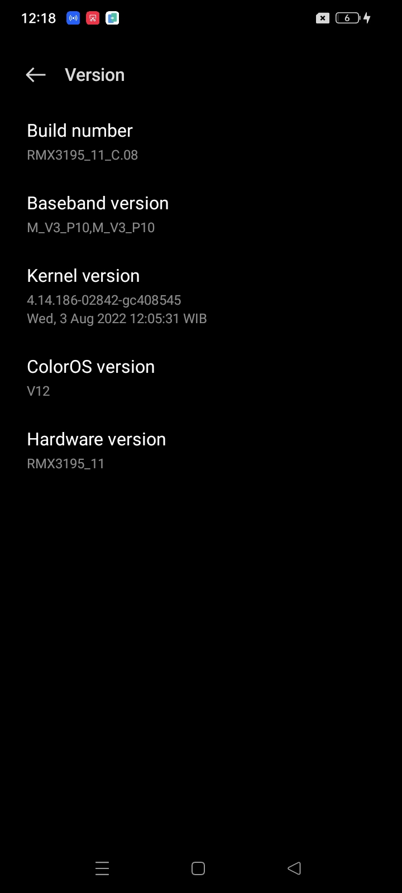

How to root realme C25s RUI v3 Android 12 RMX3195_11_C.08 tested 12 april 2024.






**WARNING: ALL EXISTING DATA WILL BE ERASED**

## Requirements

> [Full previews](https://www.webmanajemen.com/android-engineer/realme-c25s/root/C.08/)

> [Download requirement files here](https://github.com/dimaslanjaka/android-engineer/tree/master/realme-c25s/root/C.08)

- Unlocked Bootloader
- Make sure your phone version is started with **RMX3195_11_C.08**
- PC/Laptop
- USB Driver Installed [[download here]](https://github.com/dimaslanjaka/android-engineer/)
- Fasboot and Adb binary

  - *Download lastest Android platform tools*
    - Mac https://dl.google.com/android/repository/platform-tools-latest-darwin.zip
    - Linux https://dl.google.com/android/repository/platform-tools-latest-linux.zip
    - Windows https://dl.google.com/android/repository/platform-tools-latest-windows.zip

  - Unzip the folder to `platform-tools`
    - Use ADB with `./platform-tools/adb <COMMAND>` OR `open cmd.exe on the folder`

## Step to root

- Enable **USB Debugging** from Developer Settings
- Reboot into **fastboot**

```bash
fastboot flashing unlock
```

- after sending above command, your phone has confirmation dialog. Click **vol +** to confirm.
- flash **vbmeta**

```bash
fastboot --disable-verity --disable-verification flash vbmeta vbmeta.img
fastboot --disable-verity --disable-verification flash vbmeta_system vbmeta_system.img
fastboot --disable-verity --disable-verification flash vbmeta_vendor vbmeta_vendor.img
```

- flash the magisk patched boot image for **RMX3195_11_C.08**

```bash
fastboot flash boot magisk_patched-23000_KuoRX.img
```

- reboot device

```bash
fastboot reboot
```