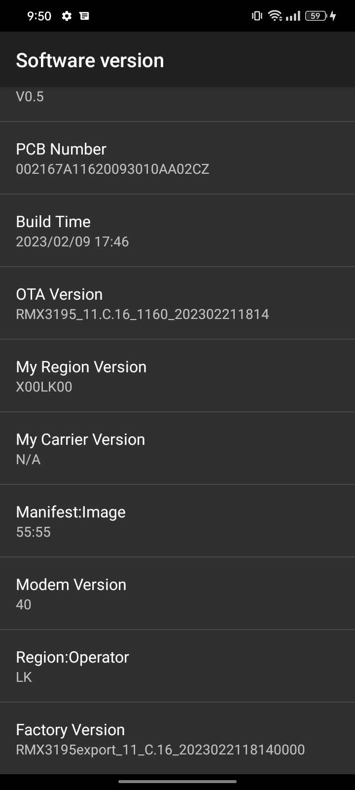

Open phone app dial *#899#
Tap on software version
Check if it matches with mine.

⚠️ First create a backup folder and move these images ⚠️

1. Patch boot.img with Magisk app.
2. Unlock your bootloader. (In depth test
> Link: https://drive.google.com/file/d/1F43p7WggEYIIKe8CwilTg41su3W8S3du/view
3. Disable dm verity.
4. Flash patched boot image.

device information

```log
9:50
Software version
V0.5
PCB Number
002167A11620093010AA02CZ
Build Time 2023/02/09 17:46
059
OTA Version
RMX3195_11.C.16_1160_202302211814
My Region Version
XOOLKOO
My Carrier Version N/A
Manifest:Image
55:55
Modem Version
40
Region:Operator
LK
Factory Version
RMX3195export_11_C.16_2023022118140000
```

